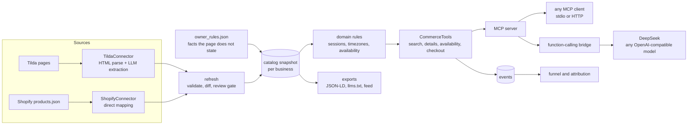

# VSA AI Commerce Layer

An external layer that makes an existing business understandable **and purchasable** by AI assistants: from a natural-language request to a checkout link, with every step tracked.

The first business on it is the **Victory Skating / VSA 6-Month Double Axel Club**, read from its Tilda landing page. Nothing on the website was changed.

```bash
uv sync                                                   # install
uv run pytest                                             # 315 tests, no network or API keys needed
uv run vsa-chat --script demo/assignment.txt              # the assignment's queries in DeepSeek (needs DEEPSEEK_API_KEY in .env)
```

Other entry points: `vsa-mcp` (MCP server), `vsa-chat --no-tools` (same model without the layer), `vsa-refresh` (re-read the source), `vsa-export` (JSON-LD, llms.txt, feed), `vsa-report` (conversion funnel).

---

## Before / after

Same model (`deepseek-v4-pro`), same queries from the assignment. Full transcripts: [without tools](docs/transcripts/deepseek-api-without-tools.md), [with tools](docs/transcripts/deepseek-api-with-tools.md). Screenshots from the DeepSeek chat app are in [docs/before](docs/before).

| | Before | After |
|---|---|---|
| Finds the product | Guesses. "VSA (Virtual Skating Academy)", a domain that does not exist (`victoryskatingacademy.com`) | Finds the 6-Month Double Axel Club for both "Victory Skating" and "VSA" |
| Price | Invented: "$297–$349 one-time, lifetime access", "$39/month", "a $250/year donor club with apparel" | $299, list price $699, about $6.23 per class |
| Billing terms | None | Billed every 6 months, renews automatically, non-refundable, cancel 48 h before renewal. Said **before** the link is shared |
| Coach, schedule, classes, level | Generic guesses | Coach Marta, Saturday and Sunday 07:00 Los Angeles time, 45 min, 48 classes, Level 3, prerequisites |
| "I'm free on November 6" | "I can't check the schedule" | "Yes: Saturday 7 and Sunday 8 November", in the customer's timezone |
| Sales flow ("under $350" → "I want to join") | Recommends competitors (iCoachSkating and others), never mentions VSA | Recommends the right club, explains it, returns the real Stripe checkout |
| Enrollment action | "I can't click join for you" | `https://buy.stripe.com/14AeVd6anbti69kcJ9dMM1M?client_reference_id=<session>` |

## How the assistant gets the data



**Sources and connectors.** A connector reads one kind of source and returns catalog data in the shared schema. Tilda pages have no structured data, so the Tilda connector parses the HTML (it drops menus, cookie banners and forms by Tilda record type, and reads payment links and the advertised start date from the markup), then an LLM turns the remaining prose into the schema. Shopify is already structured, so its connector maps fields directly and never calls a model.

**Catalog snapshot.** Customers are answered from a validated snapshot, so a conversation never depends on the website being up. `vsa-refresh` updates it: if the source is down or the extraction is bad, the previous snapshot stays live.

**Owner rules.** Some facts are not on the page or contradict it. The landing page says "Join us on October 10"; the owner says the program runs every weekend. The billing terms ("$299 every 6 months, auto-renewing, non-refundable") are only on the Stripe checkout; the page even says "monthly subscription". These live in `owner_rules.json` with who stated them and when, are applied on top of the source data, and survive every refresh. Each record keeps the page's own wording under `provenance.advertised`, so the assistant can explain the difference instead of being misled by it.

**Domain rules.** The schedule is stored once, as 07:00 in `America/Los_Angeles`, and every other timezone is computed. The landing page lists "9 pm ICT", which is only correct until the US clock change: on 7 November the class is at 22:00 in Bangkok. Availability is decided by the enrollment policy (rolling, cohort, appointment, purchase), never by a date on the page.

**Tools.** Four operations, independent of transport: `search_offerings`, `get_offering_details`, `check_availability`, `create_checkout_link`. Responses are shaped for answering a customer: billing terms in words, schedule in the customer's timezone, data freshness, and the reason each search result matches.

**Channels.** The MCP server is the single interface. DeepSeek's chat app cannot connect to MCP servers, so a bridge connects to the same server as an MCP client and exposes its tools to any function-calling model. Tool names, descriptions and schemas therefore exist in one place for every channel.

## Enrollment and checkout

`create_checkout_link` returns the business's real checkout, not a mock: the Stripe Payment Link from the "Register Now" button. Before returning it, the assistant has the price, renewal, cancellation and refund terms to read back, and the first session the customer can attend (access arrives up to 24 hours after payment, so the tool accounts for that).

The link carries `client_reference_id=<session id>`. Stripe stores it on the payment, so a `checkout.session.completed` webhook can be traced back to the AI conversation that produced it ([attribution.py](src/vsa_commerce/tracking/attribution.py)). Shopify cart links carry the same id as an order attribute. Completing payment inside the chat is not possible with a Payment Link, and the assignment allows an external checkout.

## Conversion tracking

Every tool call is an event keyed by business and session: search (query, budget), offering viewed, availability checked (requested date), checkout created, payment completed. `vsa-report` turns them into the funnel the product is measured by, "how much business did AI generate", plus the signals that come with it: what people ask for, what budgets they name, which dates they want, which channel they came from.

```
victory-skating: 7 AI session(s)
  search                    7
  offering_viewed           6  (86% of previous)
  availability_checked      2  (33% of previous)
  checkout_created          1  (50% of previous)
```

MCP `2026-07-28` is stateless, so the protocol has no session to key this on. Every response returns a `session_id` that the model passes back, and the bridge injects it on its own. The same id is the `client_reference_id`.

## Decisions

| Decision | Why | Rejected alternative |
|---|---|---|
| One MCP server for all channels, plus a function-calling bridge | DeepSeek has no MCP support; the bridge keeps one definition of every tool | A separate DeepSeek tool layer that drifts from MCP |
| One server, many connectors | The platform is the single interface a business connects to; complexity belongs inside | A server per source (Stripe, calendar, site): that is the consumer's view, not this product's |
| Source facts and owner rules kept apart | "Runs every weekend" and the billing terms are not on the page; edits to the snapshot would be lost on refresh | Hand-editing the extracted data |
| Schedule anchored in one IANA timezone | Page labels such as "PDT" or "ICT" are wrong half of the year | Storing the seven time slots from the page |
| The LLM is an untrusted parser | Output is validated, checked against the page (prices, coaches, links, platform) and sent back with the exact problems once | Trusting the model's JSON |
| Payment links and start dates read from HTML, not from the model | Facts a customer acts on must be exact | Letting the model copy URLs |
| Price, checkout, schedule and enrollment changes wait for review | A live run showed `deepseek-v4-pro` swap the price and the crossed-out price; both numbers were on the page, so grounding passed | Publishing every valid extraction |
| Derived values are computed, not copied | "$6 / Class" is $299 / 48 = $6.23; it is not a separate per-class plan | A per-session offer that does not exist |
| Structured search instead of embeddings | A handful of offerings with explicit goals, levels and prices; filters are exact and explainable | RAG with a vector store |

## Reusability: other products, businesses and platforms

Nothing outside `data/` knows about figure skating. The same schema holds a course, a salon service and a shop product ([fixtures](tests/fixtures/catalogs)), and a second business, a Shopify store, runs on the same server: `vsa-mcp --business edge-skate-shop`.

Adding a platform is one class with two methods ([base.py](src/vsa_commerce/connectors/base.py)) and one line in the [registry](src/vsa_commerce/connectors/registry.py):

```python
class SourceConnector(ABC):
    platform: ClassVar[str]

    def fetch(self) -> list[SourceDocument]: ...                          # I/O only
    def extract(self, documents: list[SourceDocument]) -> list[dict]: ...  # pure, tested on fixtures
```

| Platform | Source | Offerings | Checkout | LLM needed |
|---|---|---|---|---|
| Tilda, custom sites | HTML pages (built) | prose → schema | payment links found on the page | yes |
| Shopify | `products.json` or Storefront API (built) | products, variants, stock | cart permalink with session attribute | no |
| WordPress / WooCommerce | WooCommerce REST API, or schema.org JSON-LD on pages | products, variations | add-to-cart URL | only for plain pages |
| Mindbody | Public API: classes, services, staff, schedules | classes and appointments | booking link; real-time slot availability instead of a weekly rule | no |
| Fresha | Public booking pages (no open API) | services with durations, prices and staff | booking page | yes |

Everything after `extract` stays the same: owner rules, validation, review gate, domain rules, tools, MCP, bridge, exports and tracking. For booking platforms the main addition is live slot availability in `check_availability` instead of a recurring weekly schedule.

**Multi-tenancy.** One server for all businesses, isolated by business, not one server per business. Here each tenant is a `CommerceTools` instance over its own catalog; tool descriptions are generated from the tenant's data, and every event carries `business_id`. In production the tenant would come from the authenticated connection rather than a command-line flag.

## Passive channel

The active channel above is what makes a purchase possible. For assistants and search engines that only read, `vsa-export` writes, from the same catalog ([exports/](exports)):

- schema.org JSON-LD per offering: `Course` with a weekly `Schedule` and instructors, `Offer` with `billingDuration: P6M`, the list price and a no-refund policy, plus a `<script>` tag ready for Tilda's page head;
- `llms.txt`, a short brief for language models;
- `feed.json`, the catalog with derived values.

Over HTTP (`vsa-mcp --transport http`) the same documents are served at `/llms.txt`, `/feed.json` and `/jsonld/<offering>` next to `/mcp`. Discovery through markup is not guaranteed (indexing takes weeks and nothing obliges an assistant to read it), which is why it complements the tools rather than replaces them.

## What I deliberately did not build

- **RAG or a vector store.** Four offerings with structured goals, levels and prices: exact filters beat similarity search and can explain every match. Embeddings start to pay off with hundreds of offerings or unstructured questions, such as searching coach bios or reviews.
- **Microservices, queues, Kubernetes.** One process serves every tenant; a refresh is a function that a scheduler can call.
- **A frontend.** The assignment is about data and AI access, not visual design.
- **Changes to the Tilda site.** There is no access, and the product model is to sit above the business's systems.
- **Stripe's MCP server.** Returning the existing Payment Link needs no Stripe API calls; creating checkout sessions would need the business's Stripe keys.

## Tests

315 tests, about 97% line coverage, `mypy --strict` and `ruff`; no network or API keys needed (`uv run pytest`). They pin down what a customer would notice:

- the November 6 question, before and after the owner's rule, in several timezones;
- the 2026 clock changes: Europe on 25 October, the US on 1 November, Thailand never;
- the full sales flow through the real MCP server and the function-calling bridge, with a scripted model;
- extraction rejecting invented prices, coaches, links and platforms;
- refresh keeping the previous snapshot when the source is down, and holding price changes for review;
- the Shopify connector against a fixture in the real `products.json` format (it was also run against a live public store: 692 products and 7,454 variants validated).

## Before using this in production

- **Live data where it matters.** Availability and capacity from the booking system, prices confirmed against the payment provider (Stripe Prices or Shopify) rather than the page.
- **Stripe webhook endpoint** with signature verification, feeding `payment_completed` events; then revenue per channel and per query becomes measurable.
- **Storage and scheduling.** Catalogs, owner rules and events in Postgres with `business_id` on every row; refresh as a scheduled job per tenant; review queue with notifications instead of a CLI flag.
- **Owner workflow.** A UI where the business confirms extracted data and states rules such as "joinable any time", instead of a JSON file.
- **Remote MCP with auth.** Streamable HTTP with OAuth, the tenant taken from the token, rate limits, and audit logs of tool calls.
- **Evaluation.** A fixed set of customer questions run against each model and prompt change, checking tool choice and facts, as done manually here for DeepSeek.
- **Privacy.** Queries can contain personal details; retention rules and redaction before analytics.

## Assumptions and open questions

- The schedule is anchored in Los Angeles time (the academy is in LA). After both clock changes, an anchor in Europe gives the same times; they differ only in the week between the changes.
- "Joinable any time" was stated for the Double Axel Club. Applying it to the Double Jumps and Triple Jumps clubs is marked as an assumption in `owner_rules.json`.
- Billing terms were read from the Double Axel checkout only; the other clubs show "$299 for 6 months" without claiming a billing cycle.
- The year of "Join us on October 10" is not on the page; 2026 is assumed (it is a Saturday).

## Layout

```
src/vsa_commerce/
  domain/        schema, sessions and timezones, availability, owner rules
  catalog/       per-business snapshots
  connectors/    Tilda, Shopify, registry
  extraction/    LLM extraction with grounding checks
  sync/          refresh, onboarding, diff, review gate
  tools/         the four commerce tools
  channels/      MCP server, function-calling bridge, DeepSeek client, CLIs
  tracking/      events, funnel, Stripe attribution
  exports/       JSON-LD, llms.txt, feed
data/<business>/ catalog.json, owner_rules.json, source.json
exports/         generated passive-channel artifacts
demo/            the assignment's queries as a chat script
docs/            transcripts and screenshots
```
